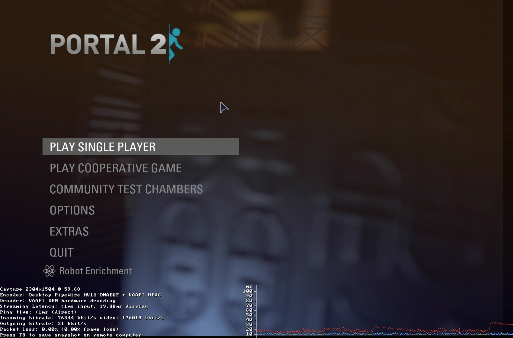

For a while, I've wanted a setup where I can simply SSH into my desktop, start Steam, and use remote play to play my games.

Gamescope offers a backend called `headless` that allows me to do this, after some messing around I got it working mostly.

There's other software like [Sunshine](https://github.com/LizardByte/Sunshine) that seem cool and have NixOS modules. I chose to avoid these because of the extra setup they need, and my use-case is a lot simpler than what they're made for.

## Steam/Gamescope Setup

First some manual setup for Steam, I had to enable Remote Play and pair my laptop to my desktop for the first time. when you first try to connect to a device to remote play from it, you need to enter a PIN on the host.

Luckily I have a monitor plugged into my desktop so I just turned that on, opened Steam in a graphical session, and got everything set up. Hopefully I only have to do this once (but also Steam loves to clear my preferences so we'll see).

My NixOS setup for steam and gamescope is this:

```nix
{
  programs.steam = {
    enable = true;
    remotePlay.openFirewall = true;
    extest.enable = false; # I'll explain this in a sec.
  };

  programs.gamescope = {
    enable = true;
    capSysNice = false; # I'll explain this too.
  };
}
```

### Extest

We disable extest since it's not really needed, and it will panic when you try to send any input to a game Steam launches. `false` is the default so you can omit the line, but figured I should mention it.

### capSysNice

This is an [already discussed](https://github.com/NixOS/nixpkgs/issues/351516) issue. The way I'm launching gamescope is causing issues with bubblewrap passing the sysnice capability to Steam. I just disable that and renice it later.

I'm like 80% sure this is a skill issue on my part to be honest. Most stuff says this has been fixed, at least in the NixOS module for Steam.

## Running Steam

With Steam set up and those options enabled, we can run gamescope. My laptop uses a 2256x1504 resolution so I'm setting that here. I set both gamescope's resolution (`-W/-H`) and Steams (`-w`/`-h`).

```sh
gamescope -W 2256 -H 1504 -w 2256 -h 1504 --backend headless --steam -- steam -tenfoot -pipewire-dmabuf
```

We launch gamescope with our preferred resolution, with a headless backend and Steam integration enabled. Then we launch Steam in big picture mode.

I'll usually start this in a GNU screen session so it doesn't stop Steam if my SSH session drops.

```sh
screen -S steam # Before running gamescope
```

## Renicing

Finally just renice all gamescope processes because it can start to degrade in performance after a while allegedly.

```sh
sudo renice -n -20 -p $(pgrep -d " " "gamescope")
```

Not the best solution but works fine. You could also repeat this for Steam and the game you're running once it launches.

## Final Results

On a wired connection all the games I've tested are responsive and work very well besides some minor issues that are more a Linux/NixOS thing™ than specific to this. Here's a screenshot from Portal 2 with the overlay enabled.



Consistently I get <1ms input latency and ~20ms display latency in-game, which for me is perfectly acceptable. I'm able to have all the settings on high now without my laptop becoming a nice and toasty 100°C.

The nice thing is how I can choose to start this whenever I want remotely; I don't need a Steam session always open on a display on my desktop. I do wish Steam would let me add non-steam games in the big-picture UI because I still have to do that manually.

## Conclusion

I'm sure Sunshine is way better in both performance and versatility but this works well enough for me and requires far less setup that I can deal with it. Security-wise I didn't want to introduce an entirely new service just to stream games, especially since it has an entire auth system to set up.

Connecting via SSH is already easy since I use keys, and Steam handles everything for the actual remote play authentication for me already, so I see it as a much simpler setup.

Of course Sunshine does a lot more than Steam so it's not really a fair comparison. I might end up trying it anyways to see how well it works.

First blog post in 2 years, maybe I'll make another one this decade!
